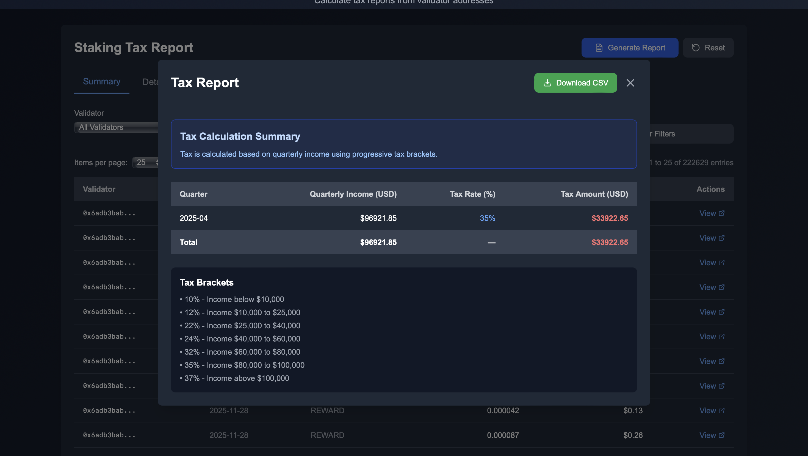

# Crypto Staking Tax Calculator

A comprehensive Next.js application for calculating **crypto tax** and **staking taxation** reports from Ethereum validator addresses. Perfect for tracking **Ethereum staking** rewards, withdrawals, and generating accurate tax reports for **crypto staking** activities.

## Overview

This **crypto staking tax calculator** helps you:
- Calculate taxes on **Ethereum staking** rewards and withdrawals
- Track validator balance changes for accurate **staking taxation** reporting
- Generate comprehensive tax reports for **crypto** staking activities
- Export data for tax filing purposes

## Features

- Upload CSV or Excel files with validator addresses
- Validate file format, duplicates, and empty rows
- Fetch transaction balance updates from Bitquery API for **Ethereum staking** data
- Process and normalize **crypto** transaction data
- Group by validator, date, and event type
- Generate aggregates (daily/monthly/yearly totals) for **staking taxation**
- Display results in sortable, filterable tables
- Export to CSV, Excel, or JSON
- Tax-year views for different jurisdictions

## Getting Started

### Final Output



**Sample Input File**: You can use [sample-validators.csv](./public/sample-validators.csv) as a reference for the expected CSV format with validator addresses.

### Prerequisites

- Node.js 18+ installed
- A Bitquery API access token (see setup instructions below)

### Installation

1. Install dependencies:
```bash
npm install
```

2. Set up environment variables:
```bash
cp .env.example .env.local
# Add your Bitquery API key
```

3. Run the development server:
```bash
npm run dev
```

4. Open [http://localhost:3000](http://localhost:3000) in your browser.

## Bitquery API Setup

This application uses the [Bitquery API](https://ide.bitquery.io/?utm_source=github&utm_medium=readme&utm_campaign=staking-tax-calculator) to fetch **Ethereum staking** data. Follow these steps to get started:

1. **Sign up for Bitquery**: Create an account at [Bitquery IDE](https://ide.bitquery.io/?utm_source=github&utm_medium=readme&utm_campaign=staking-tax-calculator)

2. **Generate Access Token**: 
   - Navigate to the [Access Token page](https://account.bitquery.io/user/api_v2/access_tokens?utm_source=github&utm_medium=readme&utm_campaign=staking-tax-calculator)
   - Follow the [steps to generate an access token](https://docs.bitquery.io/docs/authorisation/how-to-generate/?utm_source=github&utm_medium=readme&utm_campaign=staking-tax-calculator)

3. **Learn about the Staking API**: 
   - Review the [Ethereum Validator Balance Tracker documentation](https://docs.bitquery.io/docs/blockchain/Ethereum/balances/transaction-balance-tracker/eth-validator-balance-tracker/?utm_source=github&utm_medium=readme&utm_campaign=staking-tax-calculator) to understand how staking data is retrieved

4. **View the Query**: 
   - Check out the [staking tax calculation query](https://ide.bitquery.io/staking-tax-calculation?utm_source=github&utm_medium=readme&utm_campaign=staking-tax-calculator) used in this application

## Environment Variables

Create a `.env.local` file in the root directory with:

- `BITQUERY_API_KEY`: Your Bitquery API access token (required)
- `BITQUERY_API_URL`: Bitquery API endpoint (optional, default: https://streaming.bitquery.io/graphql)

**Note:** 
- The API key is kept server-side for security. Never expose it in client-side code.
- The API fetches **Ethereum staking** rewards (BalanceChangeReasonCode: 5) for the last 3 months by default.
- All validator addresses are processed in a single API call for efficiency.

## How It Works

This **crypto staking tax calculator** leverages the Bitquery API to:
- Track **Ethereum validator** balance changes
- Monitor staking rewards and withdrawals
- Calculate tax obligations for **crypto staking** activities
- Generate comprehensive reports for **staking taxation** purposes

The application processes validator addresses from uploaded files and queries the Bitquery API for transaction balance updates, specifically focusing on staking-related transactions for accurate **crypto tax** reporting.

## Use Cases

- **Crypto Tax Reporting**: Generate accurate tax reports for **Ethereum staking** activities
- **Staking Taxation**: Calculate tax obligations on staking rewards and withdrawals
- **Portfolio Tracking**: Monitor validator performance and earnings
- **Compliance**: Ensure accurate reporting for tax authorities

## License

MIT

